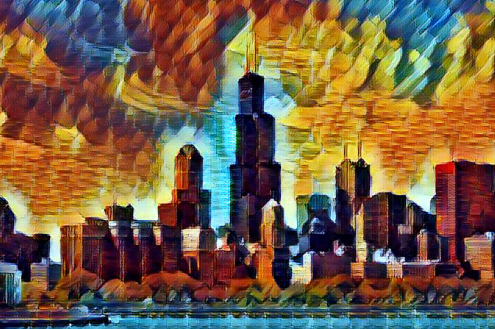
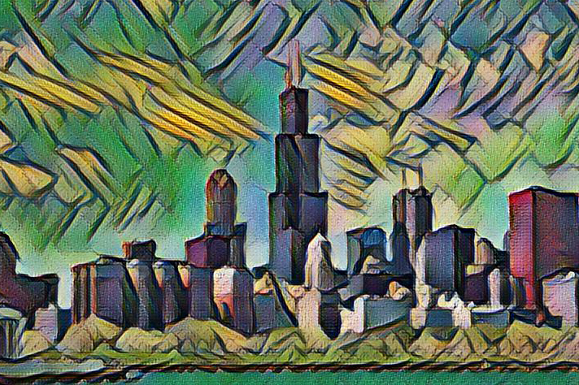
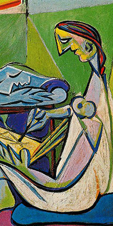

# Deep-Learning-Nanodegree
This project contains my exploration of the Deep Learning Nanodegree. 

## Project 
Find bellow the list of completed project during the Nanodegree

- [Project 1: Predicting Bike-Sharing Patterns](https://github.com/Kabongosalomon/BikeSharing) 
- [Project 2: Dog Breed Classifier](https://github.com/Kabongosalomon/CNN-Project-Dog-Breed-Classifier)
- [Project 3: Generate TV Scripts](https://github.com/Kabongosalomon/Tv-Script-Generation)
- [Project 4: Generate Faces](https://github.com/Kabongosalomon/Face-Generation-Project)
- [Project 5: Deploy a Sentiment Analysis Model](https://github.com/Kabongosalomon/Sentiment-Analysis-SageMaker-Web-App)

## [Introduction to Federated Learning and Differential Privacy](https://github.com/Kabongosalomon/Deep-Learning-Nanodegree/tree/master/Differential%20Privacy)

## Interesting Application of Deep Learning

### [Fast Style Transfers](https://github.com/Kabongosalomon/Deep-Learning-Nanodegree/tree/master/fast-style-transfer) 

#### Video Stylization 
Here we transformed every frame in a video, then combined the results. [Click to go to the full demo on YouTube!](https://www.youtube.com/watch?v=xVJwwWQlQ1o) The style here is Udnie, as above.

     

See how to generate these videos [here](#stylizing-video)!

#### Image Stylization
We added styles from various paintings to a photo of Chicago. Click on thumbnails to see full applied style images.

     

 

 

